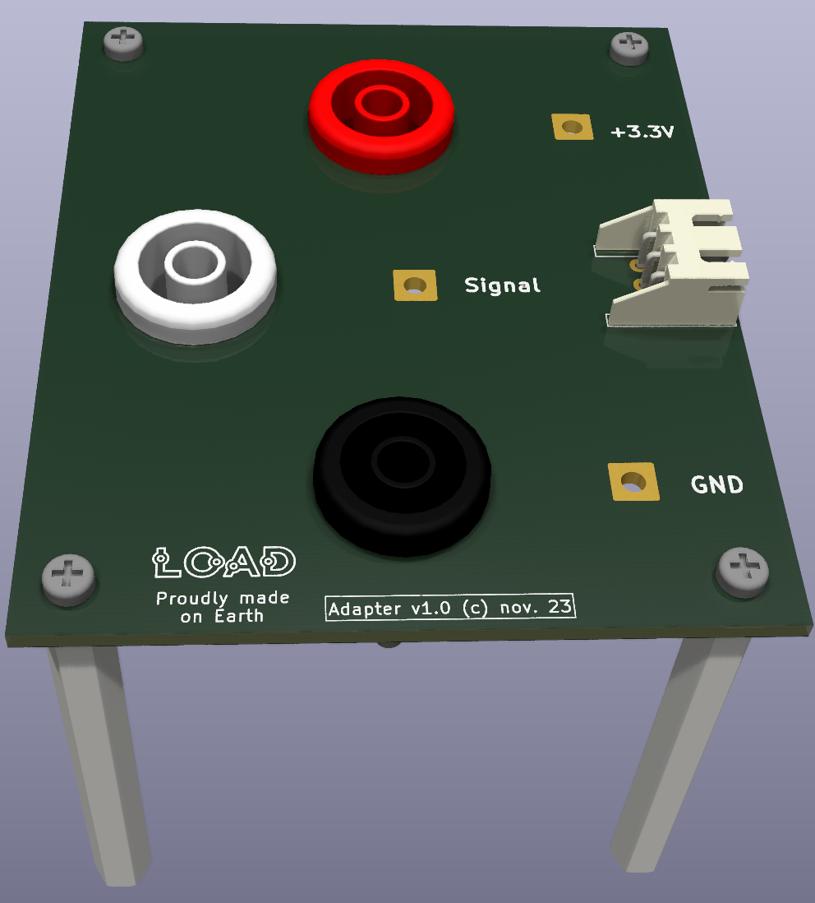

# Adaptateur pour l'étalonnage

Version 1.0, novembre 2023.

*N.B.: les circuits utilisent les symboles/empreintes/modèles Kicad de la librairie additionnelle L0AD qui peut être téléchargée depuis ce [dépôt](https://github.com/l0ad/L0AD-kicad-library) et installée depuis le gestionnaire d'extensions Kicad (par fichier).* 

Cette carte est destinée à l'étalonnage des capteurs analogiques, elle ne comporte aucun composant actif mais seulement de la connectique.

L'alimentation s'effectue en 3.3V, la connectique *JST-XH* 3 points permet la liaison avec le capteur, la connectique *SLB4* 1 point permet l'alimentation et la prise de mesure.

- Le **projet Kicad** (>= v6.0) est disponible dans le répertoire [Kicad](./Kicad).
- Les **fichiers de fabrication** sont disponibles dans le répertoire [Gerber](./Gerber).

