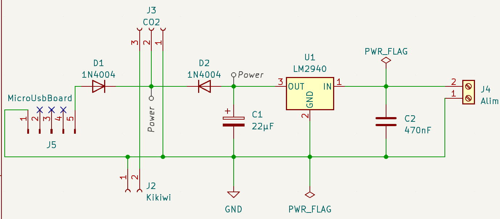
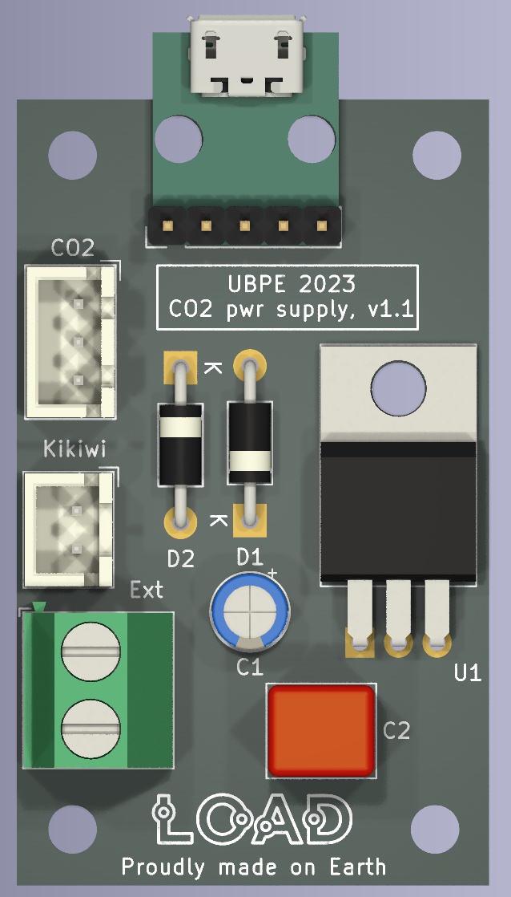

# Carte d'alimentation pour capteur CO2 SEN-0159

Version 1.1, novembre 2023.

*N.B.: les circuits utilisent les symboles/empreintes/modèles Kicad de la librairie additionnelle L0AD qui peut être téléchargée depuis ce [dépôt](https://github.com/l0ad/L0AD-kicad-library) et installée depuis le gestionnaire d'extensions Kicad (par fichier).* 

Cette carte est destinée à l'**alimentation** d'un module [module capteur de CO2 SEN0159](https://wiki.dfrobot.com/CO2_Sensor_SKU_SEN0159), et sa **connexion** à une carte *Kikiwi* (ou autre microcontrôleur).

Comme le capteur CO2 a besoin de préchauffer (et donc d'être alimenté) pendant plusieurs dizaines de minutes, il est ainsi possible d'alimenter le capteur temporairement avec une batterie externe via le port USB avant de le brancher de manière permanente à l'alimentation externe.

## Schéma de principe

La carte peut être alimentée soit via le connecteur externe (alimentation > 6V) ou directement en USB (5V). 

Le module *SEN-0159* est connecté via le connecteur JST-XH 3 points.

La carte est reliée au *Kikiwi* via le connecteur JST-XH 2 points (masse et signal uniquement, l'alimentation du capteur n'est pas prise du Kikiwi mais fournie par la carte).

La carte est conçue en deux variantes :

- avec un **connecteur MicroUSB** CMS
	- Le **projet Kicad** (>= v6.0) est disponible dans le répertoire [Kicad](./AvecConnecteurUSB/Kicad).
	- Les **fichiers de fabrication** sont disponibles dans le répertoire [Gerber](./AvecConnecteurUSB/Gerber). 
- avec un **adaptateur microUSB vers 2.54mm**, pour utiliser ce [module](https://www.amazon.fr/dp/B08ZML34CK).
	- Le **projet Kicad** (>= v6.0) est disponible dans le répertoire [Kicad](./AvecAdaptateurMicroUSB/Kicad).
	- Les **fichiers de fabrication** sont disponibles dans le répertoire [Gerber](./AvecAdaptateurMicroUSB/Gerber).  

