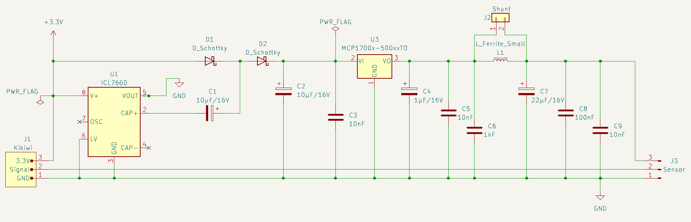
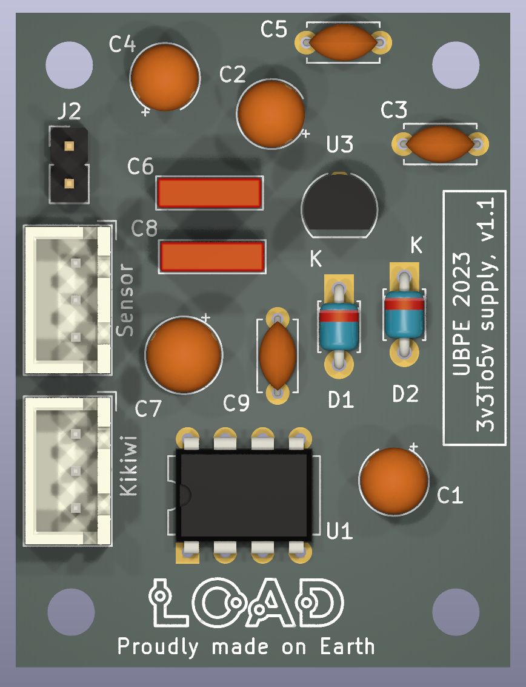
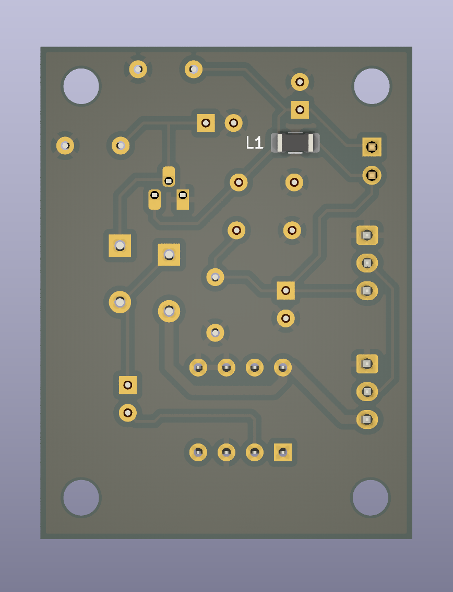

# Carte de conversion d'alimentation (3.3V vers 5V)

Version 1.0, décembre 2023.

- *N.B.: le circuit utilise les symboles/empreintes/modèles de la librairie additionnelle L0AD qui peut être téléchargée depuis ce [dépôt](https://github.com/l0ad/L0AD-kicad-library) et installée depuis le gestionnaire d'extensions Kicad (par fichier).* 

Carte carte est destinée à connecter à la carte *Kikiwi* des capteurs nécessitant une tension d'alimentation de 5v.

## Schéma de principe

L'alimentation est fournie par la carte Tenum/Planete-Sciences *Kikiwi*, qui délivre 3.3V. certains capteurs nécessitent une tension supérieure pour fonctionner correctement. 

Par conséquent, le circuit utilise un **doubleur de tension** (basé sur un ILC7660) et un régulateur **LDO** 5V. 

Le régulateur utilisé est un modèle de la série *MCP-170x-5002* mais il peut être remplacé par n'importe quel autre LDO à conditions que celui-ci soit compatible broche-à-broche et qu'il ait une chute de tension inférieure à 200 mV sous un courant de sorte de 50 mA.

Le filtre anti-bruit peut être partiellement retiré si besoin (ferrite et condensateur suivant). Dans ce cas, un cavalier doit être placé sur le connecteur de shunt.

- Le **projet Kicad** (>= v6.0) est disponible dans le répertoire [Kicad](./Kicad).
- Les **fichiers de fabrication** sont disponibles dans le répertoire [Gerber](./Gerber).