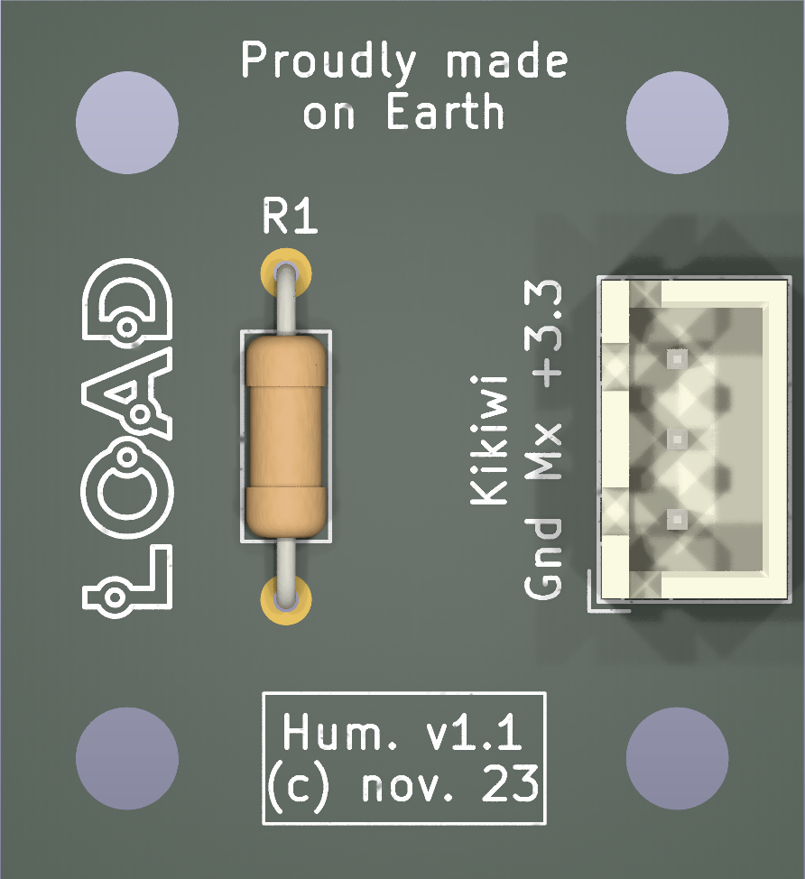

# Carte capteur d'humidité (HiH-50xx)

Version 1.1, novembre 2023.

*N.B.: les circuits utilisent les symboles/empreintes/modèles Kicad de la librairie additionnelle L0AD qui peut être téléchargée depuis ce [dépôt](https://github.com/l0ad/L0AD-kicad-library) et installée depuis le gestionnaire d'extensions Kicad (par fichier).* 

Cette carte peut être utilisée pour la mesure (analogique) d'humidité relative de l'air.

## Schéma de principe

Le capteur utilisé est de type **HiH-50xx** (voir [datasheet](https://prod-edam.honeywell.com/content/dam/honeywell-edam/sps/siot/fr-fr/products/sensors/humidity-with-temperature-sensors/hih-5030-5031-series/documents/sps-siot-hih5030-5031-series-product-sheet-009050-2-en-ciid-49692.pdf))

La tension d'alimentation est 3.3V, la connectique est de type JST-XH 3 points pour la liaison avec la carte Tenum/Planete-sciences *Kikiwi*, un micro-controleur ou un adaptateur destiné à l'étalonnage.

- Le **projet Kicad** (>= v6.0) est disponible dans le répertoire [Kicad](./Kicad).
- Les **fichiers de fabrication** sont disponibles dans le répertoire [Gerber](./Gerber).
