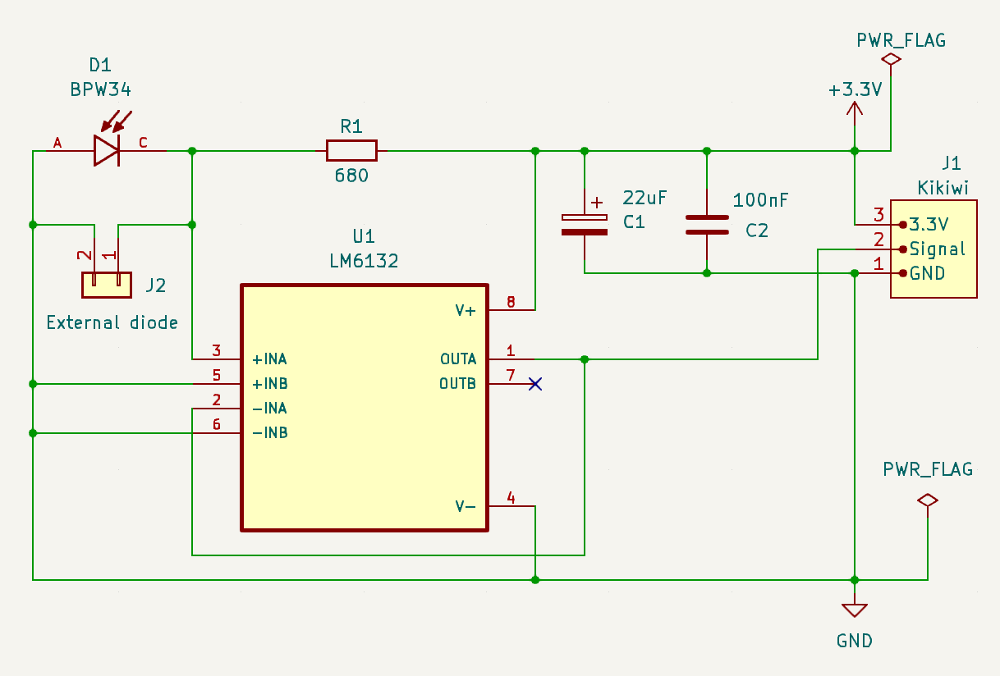
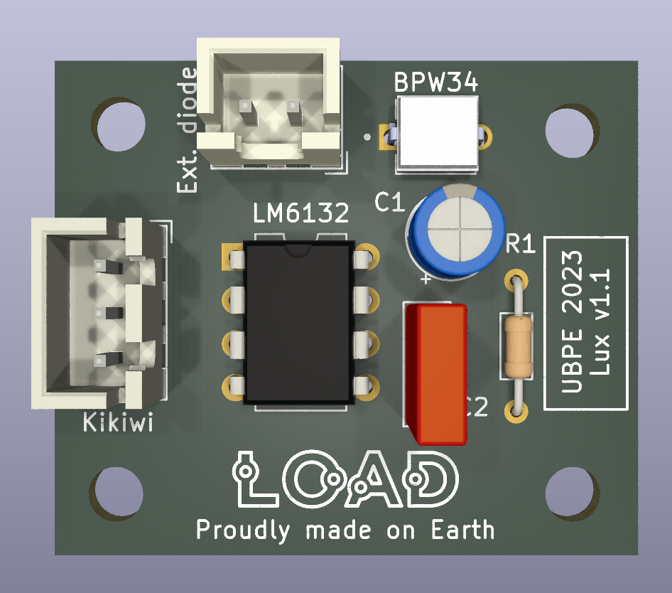

# Capteur de luminosité (visible)

Version 1.1, novembre 2023.

*N.B.: les circuits utilisent les symboles/empreintes/modèles Kicad de la librairie additionnelle L0AD qui peut être téléchargée depuis ce [dépôt](https://github.com/l0ad/L0AD-kicad-library) et installée depuis le gestionnaire d'extensions Kicad (par fichier).* 

Cette carte peut être utilisée pour la mesure (analogique) luminosité (visible, proche IR),

## Schéma de principe

Le capteur utilisé est une **photodiode BPW34** (voir [datasheet](https://www.vishay.com/docs/81521/bpw34.pdf)

La tension d'alimentation est 3.3V, la connectique est de type JST-XH 3 points pour la liaison avec la carte Tenum/Planete-sciences *Kikiwi*, un micro-controleur ou un adaptateur destiné à l'étalonnage.

La diode peut être soit soudée sur la carte (surélevée et/ou montée à l'envers pour dépasser du dos de la carte) ou déportée à l'aide du connecteur 2 broches.

Les connecteurs peuvent être au choix horizontaux ou verticaux.

- Le **projet Kicad** (>= v6.0) est disponible dans le répertoire [Kicad](./Kicad).
- Les **fichiers de fabrication** sont disponibles dans le répertoire [Gerber](./Gerber).
