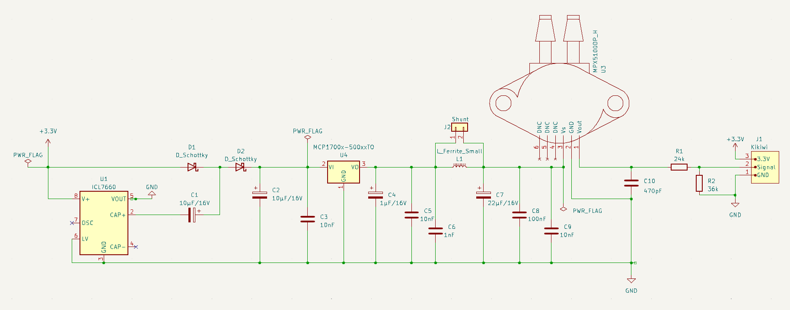

# Capteur de pression MPX5100DP

Version 1.2, novembre 2023.

*N.B.: les circuits utilisent les symboles/empreintes/modèles Kicad de la librairie additionnelle L0AD qui peut être téléchargée depuis ce [dépôt](https://github.com/l0ad/L0AD-kicad-library) et installée depuis le gestionnaire d'extensions Kicad (par fichier).* 

Cette carte peut être utilisée pour la mesure (analogique) de pression.

## Schéma de principe

Le capteur utilisé est un capteur de pression différentiel **MPX5100DP** (voir [datasheet](https://www.nxp.com/docs/en/data-sheet/MPX5100.pdf). 

*N.B. Le choix d'un capteur différentiel est motivé par sa cpacité à mesurer des différences de pression très faibles, le rendant plus adapté qu'un modèle absolu saturant plus rapidement.
*
L'alimentation est fournie par la carte Tenum/Planete-Sciences *Kikiwi*, qui délivre 3.3V. Le capteur nécessite une tension supérieure pour fonctionner correctement. Par conséquent, le circuit utilise un **doubleur de tension** (basé sur un ILC7660) et un régulateur **LDO** 5V. 

Le régulateur utilisé est un modèle de la série *MCP-170x-5002* mais il peut être remplacé par n'importe quel autre LDO à conditions que celui-ci soit compatible broche-à-broche et qu'il ait une chute de tension inférieure à 200 mV sous un courant de sorte de 50 mA.

Le filtre anti-bruit peut être partiellement retiré si besoin (ferrite et condensateur suivant). Dans ce cas, un cavalier doit être placé sur le connecteur de shunt.

Cette carte a été conçue en deux variantes :

- (presque) uniquement avec des composants traversants
	- Le **projet Kicad** (>= v6.0) est disponible dans le répertoire [Kicad](./THT/Kicad).
	- Les **fichiers de fabrication** sont disponibles dans le répertoire [Gerber](./THT/Gerber).
- avec des composants montés en surface
	- Le **projet Kicad** (>= v6.0) est disponible dans le répertoire [Kicad](./CMS/Kicad).
	- Les **fichiers de fabrication** sont disponibles dans le répertoire [Gerber](./CMS/Gerber).

