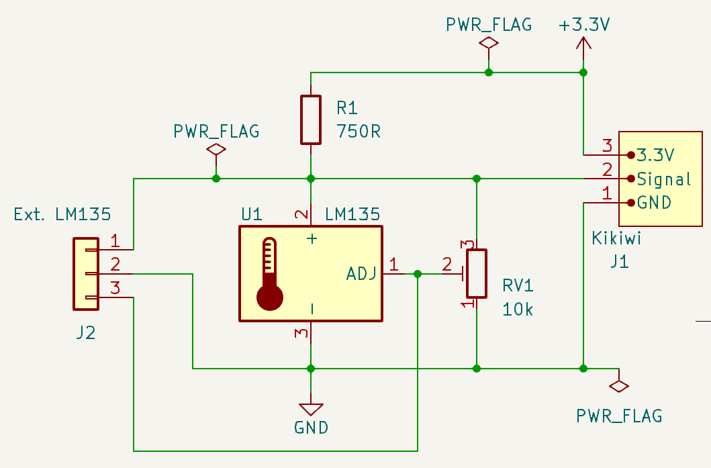
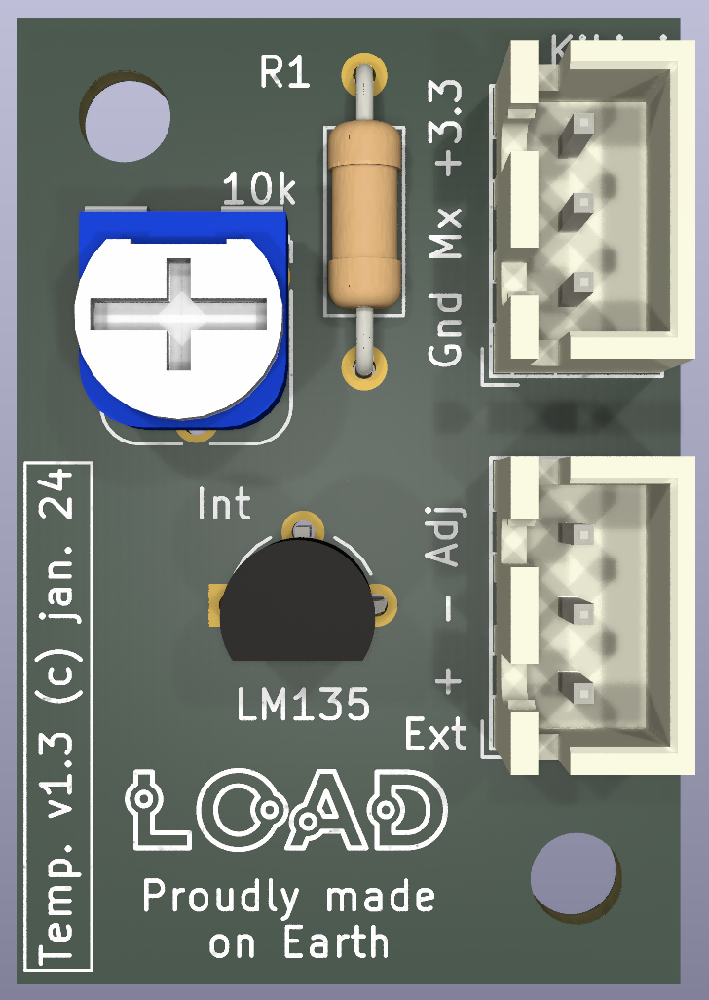

# Carte capteur de température (LM135)

Version 1.3, janvier 2024.

*N.B.: les circuits utilisent les symboles/empreintes/modèles Kicad de la librairie additionnelle L0AD qui peut être téléchargée depuis ce [dépôt](https://github.com/l0ad/L0AD-kicad-library) et installée depuis le gestionnaire d'extensions Kicad (par fichier).* 

Cette carte peut être utilisée pour la mesure (analogique) de température intérieure et extérieure (sur la plage -55/+50°C).

## Schéma de principe

Le capteur utilisé est de type **LM135** ou **LM135A** (voir [datasheet](https://www.st.com/resource/en/datasheet/lm135.pdf))

La tension d'alimentation est 3.3V, la connectique est de type JST-XH 3 points pour la liaison avec la carte Tenum/Planete-sciences *Kikiwi*, un micro-controleur ou un adaptateur destiné à l'étalonnage.

Pour la mesure de température intérieure, le capteur est soudé sur la carte (cf. vue 3D ci-dessous).

Pour la mesure de température extérieure, le capteur est déporté en utilisant le connecteur JST-XH `Ext`.

- Le **projet Kicad** (>= v6.0) est disponible dans le répertoire [Kicad](./Kicad).
- Les **fichiers de fabrication** sont disponibles dans le répertoire [Gerber](./Gerber).

